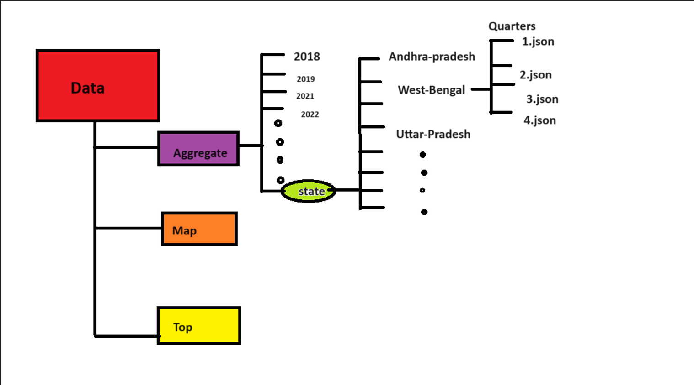
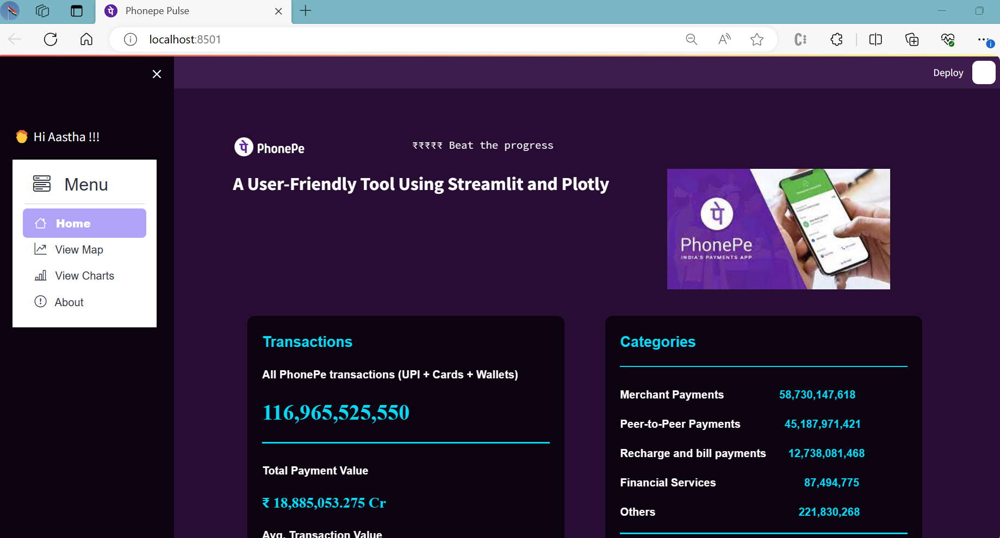
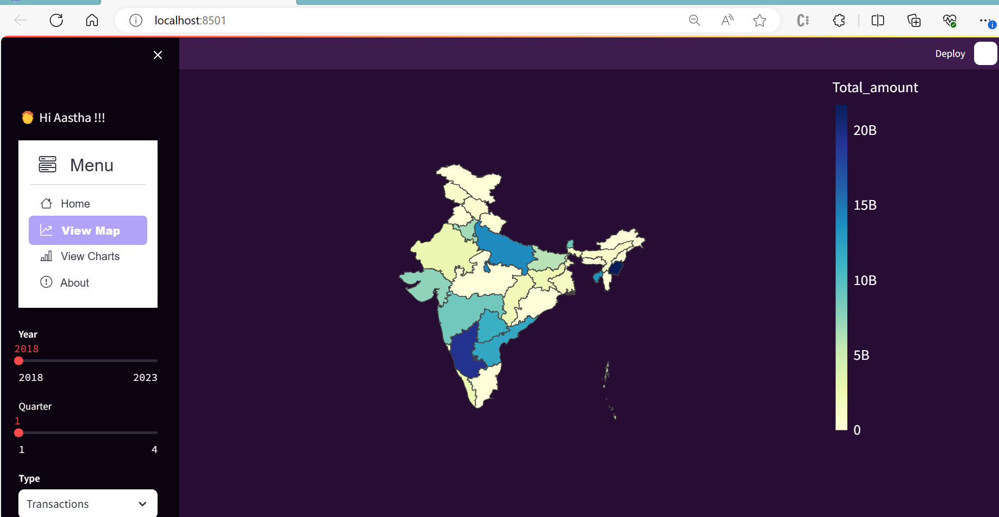
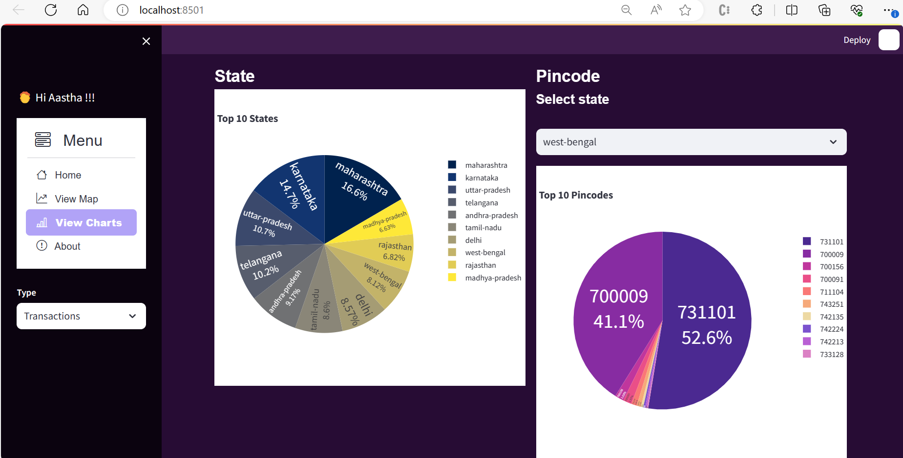
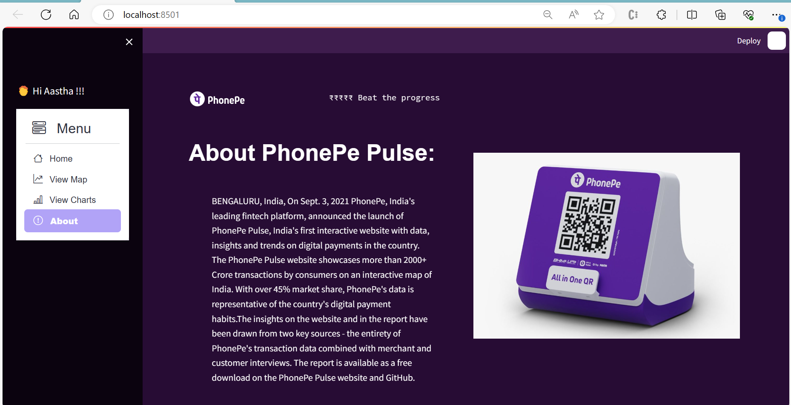
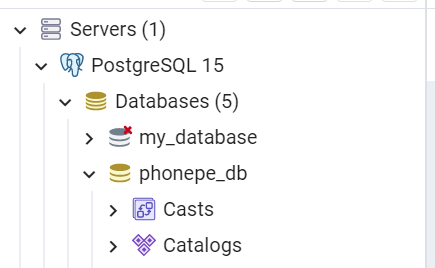
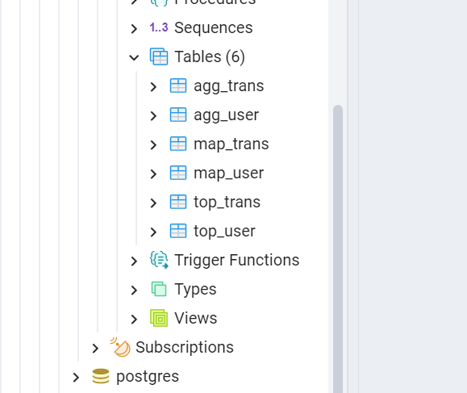
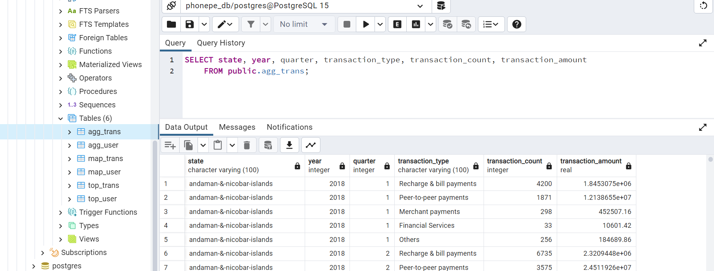

# PhonePe-Pulse-Data-Visualization-and-Exploration

This project aims to develop a  user-friendly interactive dashboard using Streamlit application to visualize the Phonepe Pulse data using Plotly.

### Problem Statement:

The Phonepe pulse Github repository contains a large amount of data related to
various metrics and statistics. The goal is to extract this data and process it to obtain
insights and information that can be visualized in a user-friendly manner.

### Dataset

### Python Libraries used :

1. plotly
2. streamlit
3. pandas
4. numpy
5. psycopg2
6. PIL

### Workflow:

1. **Data extraction:** Clone the Github using python scripting to fetch the data from the
   Phonepe pulse Github repository and store it in CSV format.

   **Phonepulse Git Repo :** [https://github.com/PhonePe/pulse.git]()
2. **Data transformation:** Using Python, along with libraries such as Pandas, data pre-processing is done. This include cleaning the data, handling missing values, and transforming the data into a format suitable for analysis and visualization.
3. **Database insertion:** Using "**psycopg2**" library in Python to
   connect to a Postgresql database and inserted the transformed CSV data files using SQL
   commands into the tables created in the database.

   CSV Files created : **aggre_transactions.csv , aggre_users.csv, map_transactions.csv, map_users.csv, top+transactions.csv , top_users.csv**
4. **Dashboard creation:** Using Streamlit and Plotly libraries in Python , created
   an interactive and visually appealing dashboard. Plotly's built-in geo map
   functions can be used to display the data on a map and Streamlit can be used
   to create a user-friendly interface with multiple dropdown options for users to
   select different facts and figures to display.

   **Home Page**

   

   **Maps Page**

   

   **Charts Page**

   

   **About Page**

   
5. **Data retrieval:** Using "**psycopg2**" library in Python to connect to the
   Postgresql database and fetch the data into a Pandas dataframe. Use the data in
   the dataframe to update the dashboard dynamically.

   The data from CSV files are stored in 6 sql tables as shown below :

   

   

   
6. **Deployment:** Geo Maps and charts are created and deployed on the dashboard publicly, making it accessible to users.
